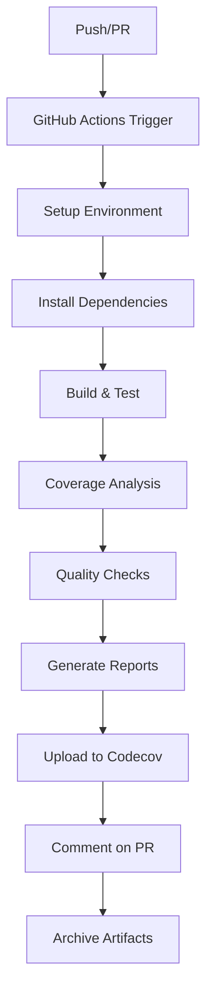

# CI/CD Pipeline Documentation

## Visión General

Este proyecto implementa un pipeline completo de integración continua y despliegue continuo (CI/CD) usando GitHub Actions, enfocado en calidad de código, testing exhaustivo y reportes de cobertura detallados.

## 🏗️ Arquitectura del Pipeline



## 🔧 Componentes del Pipeline

### 1. Environment Setup
- **OS:** Ubuntu Latest
- **Ruby:** 3.1 con bundler cache
- **Herramientas:** gcc, lcov, clang-format, clang-tidy, cppcheck
- **Framework:** Ceedling + Unity + CMock

### 2. Testing Suite
- **Framework:** Ceedling (C Testing Framework)
- **Assertions:** Unity
- **Mocking:** CMock con plugins `:ignore`, `:callback`, `:expect_any_args`
- **Cobertura:** gcov + lcov

### 3. Quality Assurance
- **Formato:** clang-format (configuración personalizada)
- **Análisis estático:** clang-tidy + cppcheck
- **Validaciones:** pre-commit hooks

### 4. Reporting
- **Codecov:** Dashboard online con trending
- **HTML Reports:** Reportes detallados con lcov
- **PR Comments:** Comentarios automáticos con resultados

## 📊 Métricas y Umbrales

### Cobertura de Código
- **Objetivo:** >80%
- **Actual:** ~81.2%
- **Medición:** Líneas de código ejecutadas por tests

### Calidad de Código
- **Estilo:** 100% conformidad con clang-format
- **Análisis estático:** 0 warnings críticos
- **Complejidad:** Seguimiento con cppcheck

## 🚀 Triggers del Pipeline

### Automáticos
- **Push** a ramas `main` y `leds_test`
- **Pull Requests** hacia `main`

### Manuales
- Workflow dispatch (manual trigger desde GitHub UI)
- Re-run failed jobs

## 📋 Outputs del Pipeline

### Artifacts
1. **Coverage Reports** (HTML + Text)
2. **Test Results** (JUnit XML)
3. **Static Analysis Reports**
4. **Build Logs**

### External Services
1. **Codecov Dashboard**
2. **GitHub Status Checks**
3. **PR Comments con resultados**

## 🔍 Debugging del Pipeline

### Logs Importantes
```bash
# Ver logs de test execution
Actions -> Workflow Run -> Build & Test

# Ver coverage generation
Actions -> Workflow Run -> Generate coverage report

# Ver static analysis
Actions -> Workflow Run -> Check formatting
```

### Archivos de Configuración
- `.github/workflows/ci.yml` - Definición del pipeline
- `project.yml` - Configuración de Ceedling
- `codecov.yml` - Configuración de Codecov
- `.clang-format` - Reglas de formato
- `.clang-tidy` - Reglas de análisis estático

## 🛠️ Mantenimiento

### Actualizar Dependencies
- Bump Ruby version en workflow
- Actualizar versiones de actions
- Sync herramientas con nuevas versiones

### Modificar Umbrales
- Codecov config en `codecov.yml`
- Quality gates en workflow
- Badge thresholds

### Agregar Nuevos Checks
1. Añadir step en workflow
2. Configurar herramienta en setup
3. Integrar resultados en reporting

## 📈 Evolución del Pipeline

### Próximas Mejoras
- [ ] Dependency vulnerability scanning
- [ ] Performance benchmarking
- [ ] Multi-platform testing (Windows, macOS)
- [ ] Container-based testing
- [ ] Security scanning (SAST)

### Métricas Históricas
- **Build Success Rate:** Tracking automático
- **Coverage Trend:** Dashboard de Codecov
- **Performance:** GitHub Actions insights

## 🔗 Enlaces Útiles

- [GitHub Actions Workflows](https://github.com/Nacholazabal/IdS-Ignacio-Olazabal/actions)
- [Codecov Dashboard](https://codecov.io/gh/Nacholazabal/IdS-Ignacio-Olazabal)
- [Ceedling Documentation](http://www.throwtheswitch.org/ceedling)
- [Unity Framework](http://www.throwtheswitch.org/unity)
- [CMock Framework](http://www.throwtheswitch.org/cmock)
